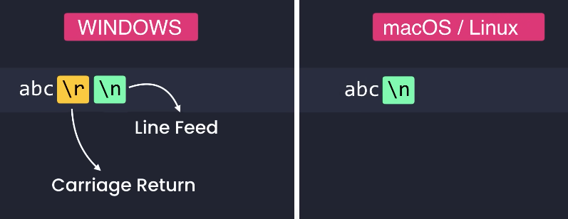

#  Git

```bash
git --version      # It shows the version of git.
```


```bash
git config --global user.name "John Doe"

# Configuring the username for the system globally.
# "" is used because of the space between words.
```

```bash
git config --global user.email JohnDoe@gmail.com

# Configuring the Email for the system globally.
```

```bash
git config --global core.editor "code --wait"

# Configuring the default text editor for the system globally.
```

```bash
git config --global -e

# -e -> open an editor
# Open the default editor to change the config file.
```



```bash

git config --global core.autocrlf input  # for linux / macOS
git config --global core.autocrlf true   # for Windows 

# Configuring the line ending for the system globally.
```

```bash
git config --global diff.tool vscode
git config --global difftool.vscode.cmd "code --wait --diff $LOCAL $REMOTE"

# Configuring the default text editor to diff tool for the system globally.
```

```bash
git difftool   # Shows unstaged changes to graphically(vscode).
git difftool --staged   # Shows staged changes to graphically(vscode).
git difftool --cached   # Same as the above to graphically(vscode).

# View the changes made to the file to graphically(vscode).
```

```bash
git config --help  # Syntax guide and commands git.

git config -h  # A short guide to git syntax and commands.
```

```bash
git init  

# The creation of a secret git directory inside the relevant directory for storing and controlling project changes.
```

```bash
git status  

# It shows the complete information of the files that were recently created or changed, deleted and... with its messages and related information. If everything is in order, it should return an empty result. (Staged and unstaged files are shown with this command.) Staged in green and unstaged in red.

git status -s  

# Show status concisely and short. The first letter of all messages is displayed in short form with the same colors.
```

```bash

git add file1.[Suffix]  # Add one file.
git add file1.[Suffix] file2.[Suffix]  # Add two file.
git add *.[Suffix]  # Add all files that have a specific suffix.
git add . # Add all files.

# Add files to staging mode.
```

##### ⭐ Committing is like taking a picture of a project. (that is, saving the committed code section in the git repository.


 
 

```bash
git commit

# When a short explanation is not enough and there is a need to explain the conditions and limitations, use this command to open the system's default editor so that we can write the commit message there.

git commit -m "message"  

# The changes are saved and staged along with a message that specifies the nature of the changes. (Contains the commit message)

git commit -m "message" -m "Description"

# Contains commit message and description.

git commit -a

# It means to commit all modified files, which if used alone, the default editor will open and wait for the commit message to be entered.

git commit -a -m "message"  |  git commit -am "message"

# By using -m, the default editor is no longer opened and the commit message is written on the same line. Instead of using the command -a and -m separately, they can be written as abbreviated -am at once. Of course, this command is only used when our file already exists and has only changed, which means we know what we are doing, but in 90% of the cases, the file must be staged first and then committed.
```

```bash
git ls-files  # Shows the files that are in the staging area.

git ls-tree HEAD or HASH-code or etc

# view commits hierarchically or parent-child. 
# (tree -> directory, blob -> file)
```

##### ⭐ If we delete the file using the empty rm command, it is still in the staging area and is only deleted from the work area, and to remove it from the staging area, we must use the git add command again. means staging the deletion of the file. To remove the file from the staging area as well as the working area, the git rm command should be used.

```bash
git rm file1.[Suffix]  # remove one file.
git rm file1.[Suffix] file2.[Suffix]  # remove two file.
git rm *.[Suffix]  # remove all files that have a specific suffix.

git rm --cached -r directory or file name

# When the names of files or directorys are included in the .gitignore file, but they are still in the staging area, they should be removed from this area using this command. After this, it is no longer tracked by changing the file.

# Remove files from stage area and work area.
```

##### ⭐ The operation of moving or renaming files or cutting files, includes two operations. 1- operation to delete the previous file and 2- operations to generate a new file. Like the rm command, if this command is used alone, only the file is deleted from the work area and the new file is added there. To perform this operation both in the working area and in the staging area, the command git mv should be used. (If both changes are staged, after running the git status command, we will see only one staged change named renamed, which shows the change of the first file to the second file.)

```bash
git mv file1.[Suffix] file2.[Suffix]  # Moving or renaming file1 to file2.

# Moving or renaming files in stage area and work area.
```

##### ⭐ If we want to not include a file or directory in staging and git does not track them, we must create a file called .gitignore and write the name of the directory or file that we do not want to be tracked in it. If we store a file or directory once in the repository and then save their names in the gitignore file. Let's write them, they are still considered and are present in the list of files.

```bash
echo file or forder name > .gitignore  

# Creating a .gitignore file and putting the corresponding file or directory name in it.

code .gitignore

# With this command, we can edit the codes inside the .gitignore file in the vscode environment.
```
‍‍```
```bash
git diff   # Shows unstaged changes.
git diff --staged   # Shows staged changes.
git diff --cached   # Same as the above.
git diff branch_name # Shows unstaged changes in the target branch.

# View the changes made to the file.
```

##### ⭐ The master branch in git is the main and default branch, which is also called main or trunk in some cases. The header in the main branch is a reference to the current branch, i.e. the highest or most recent change commit available so far in the current branch.

```bash
git log  # full history
git log file.txt  # Shows the commits that touched file.txt

git log --stat file.txt  

# Shows statistics (the number of changes) for file.txt

git log --patch file.txt  # Shows the patches (changes) applied to file.txt
git log --oneline  # summary history
git log --reverse  # Lists the commits from the oldest to the newest.
git log --oneline --reverse  # Both of the above at the same time
git log --stat  # Shows the list of modified files.
git log --patch  # Shows the actual changes (patches).
git log -3  # Shows the last 3 entries.
git log --author="John"  # History of commits by author named john.
git log --before="2020-08-17"
git log --after="one week ago"
git log --grep="GUI"  # Commits with “GUI” in their message.
git log -S"GUI"  # Commits with “GUI” in their patches.
git log hash1..hash2  # Range of commits.
git log file.txt  # Commits that touched file.txt.
git log --pretty=format:"%an committed %H"  # Formatting the log output.

# To view the history of commits.
```

```bash
git show  # Show commit head.
git show HASH-code # Show comity with this hash code.
git show HEAD~1 # Show a commit before head.

git show HEAD~2:file1.txt

# Shows the version of file stored in this commit.


# Show commit
```

```bash
git restore --staged file 

# Copies the last version of file.js from repo to index.

git restore file  # Copies file.js from index to working directory.
git restore file1 file2  # Restores multiple files in working directory.
git restore .  # Discards all local changes (except untracked files)
git clean -fd  # Removes all untracked files.

git restore --source=HEAD~1 file  

# The wrongly committed file (delete, change, etc.) deletes that commit (the head goes one step lower)
```

```bash
git clone HTTP or SSH clone URL

# To download the repository and drag it to work on it in the local environment.
```

```bash
git remote  # Shows remote repos.

git remote -v  

# It shows the repositories connected to our local repository.

git remote add origin url  # Adds a new remote called origin.
git remote rm origin  # Remove remotes origin.
git remote rename origin  # Rename remotes origin.
```

```bash
git push  # Shortcut for "git push origin branch_name"
git push origin branch_name  # Pushes branch_name to origin.

git push -u origin branch_name  

# By default, the push is done to the same place as the remote.
```

```bash
git branch  # Displays a list of all branches in the project.
git branch branch_name  # Create a branch with the named branch_name.

git branch -d branch_name  

# Delete the branch with the name of the branch name.

git branch --merged  # Shows the merged branches.
git branch --no-merged  # Shows the unmerged branches.
```

```bash
git checkout branch_name  # Switch to a branch named branch_name.

git checkout -b branch_name 

# Build and switch to a branch named branch_name.

git checkout -f branch_name

# Ignore the changes of the current branch and switch to a branch named branch_name.
```

```bash
git merge branch_name  

# Merges the branch_name branch into the current branch

git merge --no-ff branch_name  

# Creates a merge commit even if FF is possible

git merge --squash branch_name  # Performs a squash merge
git merge --abort  # Aborts the merge
```

```bash
git pull  # Shortcut for "git pull origin branch_name"
git pull origin branch_name  # Pulled branch_name to origin.
```

```bash
git reset  # Cancel staging

git reset HEAD~1

# Undo the change committed in the commit one below the head

git reset HASH-code

# Undo the committed change in the commit with the corresponding hash code

git reset --soft HEAD^  # Removes the last commit, keeps changed staged
git reset --mixed HEAD^  # Unstages the changes as well
git reset --hard HEAD^  # Discards local changes

git reset --hard HASH-code  

# Discards changes in the commit with the corresponding hash code
```
<br/>
<br/>
<br/>

[Full cheat sheet](./pdf/Git-Cheat-Sheet.pdf)

[Git Pro Book](./pdf/Scott_Chacon_%20Ben%20Straub-Pro_Git_2023.pdf)
